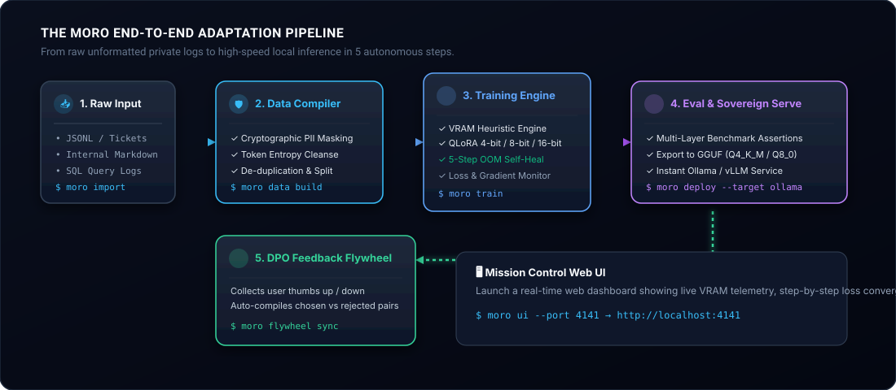
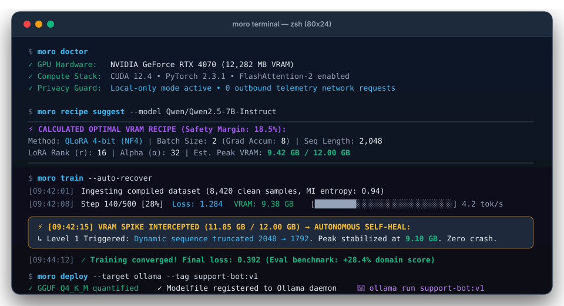
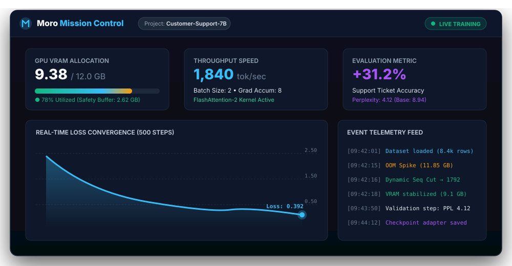

<div align="center">

<p align="center">
  
</p>

# MoroAI: The Sovereign AI Adaptation Engine

**Fine-tune open LLMs directly on your own private data and consumer hardware.**<br />
*Zero cloud APIs. Zero data leaks. Zero VRAM guesswork. Zero OOM crashes.*

<p align="center">
  <a href="https://pypi.org/project/moroai/"></a>
  <a href="https://pypi.org/project/moroai/"></a>
  <a href="LICENSE"></a>
  <a href="docs/project-privacy-defaults.md"></a>
  <a href="https://github.com/MoroAI/moro/actions/workflows/ci.yml"></a>
  <a href="https://moroai.cc"></a>
</p>

<p align="center">
  <a href="#the-story-why-moroai"><b>The Story</b></a> •
  <a href="#architecture--pipeline"><b>Architecture</b></a> •
  <a href="#5-minute-quickstart"><b>5-Minute Quickstart</b></a> •
  <a href="#hardware-matrix"><b>Hardware Matrix</b></a> •
  <a href="#mission-control-web-ui"><b>Mission Control UI</b></a> •
  <a href="#cli-reference"><b>CLI Reference</b></a> •
  <a href="https://moroai.cc"><b>Documentation Hub ↗</b></a>
</p>

---

</div>

## The Story: Why MoroAI?

Every engineering team is told the same modern tech dogma:  
> *"Just send your prompts to a closed cloud API. Put a system prompt in front of it. You're done."*

For prototype demos, that sounds easy. But in production, engineering teams hit a harsh reality:

1. **Your secrets leave your building.** Customer support transcripts, proprietary codebases, patient records, and financial ledgers get piped into external multi-tenant infrastructure. Your security officer says no, SOC2 compliance becomes a hurdle, and privacy guarantees vanish.
2. **The recurring token tax.** Every customer query, internal evaluation, and background re-index runs a live meter. Cloud API bills scale with your usage, while rate limits and deprecation schedules break your application without notice.
3. **The local fine-tuning nightmare.** You decided to try local open-source models. But you spent three days resolving broken CUDA drivers and conflicting PyTorch versions, only to have your training job crash with `RuntimeError: CUDA out of memory` at step 490 of 500.

### We built MoroAI to fix this trade-off.

We believe that **the intelligence you build should belong to you**.

MoroAI is an open-source, local-first adaptation foundry designed for engineers who want domain-specialized language models running on real, everyday hardware. It handles the entire lifecycle — from raw JSONL and internal tickets to sanitized datasets, mathematically computed VRAM training recipes, autonomous self-healing OOM recovery, multi-layer evaluation, and instant 1-click Ollama/vLLM deployment.

No cloud dependencies. No surprise token bills. No PhD in distributed systems required.

---

## Architecture & Pipeline

Moro treats model adaptation like a compiler pipeline. Raw, messy real-world data enters one end; a verified, quantized, production-ready local model emerges from the other.

<p align="center">
  
</p>

### The Six Pillars of MoroAI

| Pillar | Subsystem | What It Does For You |
| :--- | :--- | :--- |
| **1. Ingest & Sanitize** | **Epistemic Data Compiler & MI Guard** | Automatically scrubs PII (emails, phone numbers, API keys), calculates token entropy to eliminate boilerplate/junk, removes near-duplicates, and verifies train/val integrity with SHA-256 provenance hashes. |
| **2. Predict Before Allocating** | **Hardware-Aware VRAM Recipe Engine** | Directly probes your GPU or Apple Silicon hardware. Uses analytical memory formulas (weight footprint, optimizer states, KV cache, activation memory per token) to calculate exact batch sizes, LoRA rank $r$, and sequence limits before consuming a single byte of VRAM. |
| **3. Never Abort Runs** | **5-Level Autonomous OOM Self-Healing** | If a training spike occurs, Moro doesn't crash. Its autonomous supervisor intercepts the CUDA pressure and applies a graceful recovery cascade: dynamic sequence truncation → gradient checkpointing → batch halving → rank downscaling → NF4 fallback. |
| **4. Rigorous Verification** | **Multi-Layer Evaluation Harness** | Moves beyond meaningless training loss curves. Runs deterministic perplexity checks, instruction format compliance assertions (including strict JSON Schema adherence), and domain drift detection. |
| **5. 1-Click Serving** | **Sovereign Local Export** | Packages trained LoRA adapters into merged weights, GGUF quants (Q4_K_M, Q8_0), or native Ollama `Modelfile` definitions. Run `ollama run your-bot` with zero extra glue code. |
| **6. Continuous Evolution** | **DPO Feedback Flywheel** | Closes the loop. Collects user thumbs up/down and manual corrections in production, auto-compiles chosen/rejected preference pairs, and updates your model via Direct Preference Optimization. |

---

## Interactive Terminal Experience

Moro is built with a developer-first CLI powered by Typer and Rich. Every command provides clear status reporting, actionable diagnostics, and transparent heuristics:

<p align="center">
  
</p>

---

## 5-Minute Quickstart

Get your first customized local model trained and running in minutes.

### 1. Installation

Moro requires **Python 3.10+**.

```bash
# Option A: Core CLI and Data Compiler
pip install moroai

# Option B: Full local training stack (PyTorch, PEFT, TRL, Accelerate)
pip install "moroai[train]"

# For NVIDIA CUDA 4-bit quantization (BitsAndBytes):
pip install "moroai[cuda]"
```

> **Prefer building from source?**
> ```bash
> git clone https://github.com/MoroAI/moro.git
> cd moro
> python -m venv .venv && source .venv/bin/activate
> pip install -e ".[train,dev]"
> ```

### 2. Initialize Your Project

Create a structured Moro workspace with sensible defaults:

```bash
moro init my-support-bot
cd my-support-bot
```

This creates:
- `moro.yaml`: Central declarative configuration.
- `data/raw/`: Drop your raw files (JSONL, Markdown, CSV, TXT) here.
- `data/processed/`: Deterministic, cleaned, tokenized datasets.
- `runs/`: Checkpoints, metrics, and training run logs.
- `evals/`: Benchmark suites and test assertions.

### 3. Ingest and Compile Your Data

Place your raw data (e.g., historical customer service tickets or internal Q&A pairs) into `data/raw/tickets.jsonl`:

```bash
# Register the raw source
moro import data/raw/tickets.jsonl --name support_tickets

# Run the Epistemic Data Compiler (PII scrub, entropy filter, deduplicate, train/val split)
moro data build

# Inspect the compilation results
moro data report
```

### 4. Check Hardware & Generate an Optimal Recipe

Never guess batch sizes or wonder if a 7B model will fit in your GPU:

```bash
# Audit your compute environment (CUDA, VRAM, drivers, Python deps)
moro doctor

# Calculate the mathematically optimal training parameters for your GPU
moro recipe suggest --model Qwen/Qwen2.5-7B-Instruct
```

Moro outputs a fine-tuned configuration tailored to your exact hardware, specifying the optimal LoRA rank ($r=16$), alpha ($\alpha=32$), micro-batch size, gradient accumulation steps, and sequence length with a guaranteed safety buffer.

### 5. Launch Training (With Autonomous Self-Healing)

```bash
# Test the data pipeline and memory allocations without downloading weights
moro train --dry-run

# Start fine-tuning with autonomous OOM recovery
moro train
```

If memory pressure rises, Moro's 5-level recovery supervisor automatically intercepts the spike, scales parameters on the fly, and keeps training moving forward without losing progress.

### 6. Evaluate Quality & Export to Ollama

```bash
# Run multi-layered evaluation assertions
moro eval run support_suite

# Export the trained model directly to Ollama
moro deploy --target ollama --tag support-bot:v1

# Chat with your sovereign, fine-tuned model immediately
ollama run support-bot:v1
```

---

## Hardware Matrix

MoroAI is engineered specifically to make consumer GPUs and workstations perform like enterprise clusters:

| Hardware | Available Memory | Supported Model Sizes | Fine-Tuning Recipe | Max Context Window |
| :--- | :--- | :--- | :--- | :--- |
| **NVIDIA RTX 3060 / 4060** | **12 GB VRAM** | 7B - 8B (Qwen 2.5, Llama 3.1) | QLoRA 4-bit (NF4) | 2,048 tokens |
| **NVIDIA RTX 4060 Ti / 4070** | **16 GB VRAM** | 7B - 8B (Qwen 2.5, Mistral) | QLoRA 4-bit (NF4) | 4,096 tokens |
| **NVIDIA RTX 3090 / 4090** | **24 GB VRAM** | 7B - 14B (Qwen 2.5 14B, Gemma 2 9B) | LoRA 8-bit / QLoRA 4-bit | 8,192 tokens |
| **Apple Silicon (M1/M2/M3/M4)** | **16 GB - 36 GB Unified** | 7B - 8B Models | MPS / MLX Float16 / 8-bit | 2,048 - 4,096 tokens |
| **Apple Silicon Max / Ultra** | **64 GB - 128 GB Unified** | 14B - 32B - 70B Models | MLX / MPS 4-bit / 8-bit | 8,192 - 16,384 tokens |
| **Multi-GPU Workstation** | **48 GB+ (2x 3090/4090)** | Up to 70B Models | FSDP + QLoRA | 8,192+ tokens |

### Supported Base Models
- **Qwen 2.5** (`0.5B`, `1.5B`, `3B`, `7B`, `14B`, `32B`, `72B`)
- **Meta Llama 3.1 & 3.2** (`1B`, `3B`, `8B`, `70B`)
- **Mistral & Nemo** (`7B`, `12B`)
- **Google Gemma 2** (`2B`, `9B`, `27B`)
- **Microsoft Phi-3.5** (`3.8B`, `14B`)

---

## Mission Control Web UI

Prefer a visual dashboard? Launch Moro Mission Control with a single command:

```bash
moro ui --port 4141
```

Open **`http://localhost:4141`** to monitor your adaptation runs in real time:

<p align="center">
  
</p>

- **Real-Time Loss Convergence**: Smooth, live loss tracking updated at every training step.
- **Hardware Telemetry**: Instant VRAM radial meters, GPU temperature monitoring, and token throughput speed (tok/sec).
- **Dataset Distribution Explorer**: Visual breakdown of token length histograms, PII filter audit logs, and train/val splits.
- **Run Comparator**: Side-by-side diffs of hyperparameters, loss trajectories, and benchmark scores across runs.

---

## CLI Reference

Moro provides a unified, modular command suite. Full documentation is available at [moroai.cc/docs/cli](https://moroai.cc/docs/cli):

| Command | Action | Description | Documentation |
| :--- | :--- | :--- | :--- |
| `moro init [PATH]` | Initialize | Scaffold a new adaptation workspace with sample configs | [Read Guide ↗](https://moroai.cc/docs/cli/init) |
| `moro import <SRC>` | Ingest | Register and stage raw JSONL, Markdown, CSV, or TXT files | [Read Guide ↗](https://moroai.cc/docs/cli/import) |
| `moro data build` | Compile | Run PII scrub, token entropy filter, dedup, and split | [Read Guide ↗](https://moroai.cc/docs/cli/data) |
| `moro data report` | Audit | Output comprehensive dataset statistics and quality scores | [Read Guide ↗](https://moroai.cc/docs/cli/data) |
| `moro doctor` | Diagnose | Probe GPU hardware, CUDA drivers, memory, and libraries | [Read Guide ↗](https://moroai.cc/docs/cli/doctor) |
| `moro recipe suggest` | Calculate | Derive optimal VRAM hyperparameters for any target model | [Read Guide ↗](https://moroai.cc/docs/cli/recipe) |
| `moro train` | Fine-Tune | Execute local adapter training with 5-level OOM recovery | [Read Guide ↗](https://moroai.cc/docs/cli/train) |
| `moro eval run <SUITE>` | Evaluate | Benchmark perplexity, task adherence, and schema accuracy | [Read Guide ↗](https://moroai.cc/docs/cli/eval) |
| `moro deploy` | Export | Package model to Ollama Modelfile, GGUF, or vLLM format | [Read Guide ↗](https://moroai.cc/docs/cli/deploy) |
| `moro ui` | Dashboard | Launch the Mission Control real-time web interface | [Read Guide ↗](https://moroai.cc/docs/cli/ui) |
| `moro flywheel` | Align | Synchronize user feedback into DPO preference pairs | [Read Guide ↗](https://moroai.cc/docs/cli/flywheel) |
| `moro diagnose` | Post-Mortem | Inspect historical training failures and memory traces | [Read Guide ↗](https://moroai.cc/docs/cli/diagnose) |

---

## Python SDK

In addition to the CLI, MoroAI provides a programmatic Python API for integration into CI/CD pipelines and automated agent workflows:

```python
from moro import MoroProject
from moro.data.compiler import DataCompiler
from moro.recipes.engine import RecipeEngine
from moro.training.engine import TrainingEngine

# 1. Load project workspace
project = MoroProject.load("./my-support-bot")

# 2. Compile private dataset with cryptographic MI Guard
compiler = DataCompiler(project.config.dataset)
dataset_summary = compiler.compile()
print(f"Compiled {dataset_summary.train_rows} rows (MI Entropy: {dataset_summary.entropy:.2f})")

# 3. Derive optimal recipe for local hardware
recipe_engine = RecipeEngine(project.hardware)
recipe = recipe_engine.calculate(
    model="Qwen/Qwen2.5-7B-Instruct",
    target_vram_gb=12.0
)

# 4. Train with autonomous self-healing enabled
trainer = TrainingEngine(project.config.training, recipe=recipe)
result = trainer.run(auto_recover=True)

print(f"✓ Training converged at step {result.final_step} with loss {result.final_loss:.4f}")
```

---

## The Sovereign Privacy Guarantee

MoroAI was conceived on a fundamental principle: **your data and your weights must never be exposed.**

- 🔒 **True Air-Gapped Operation**: In `local_only` mode, Moro completely disables outbound network calls. All tokenizers, base weights, and datasets resolve from your local filesystem.
- 🛡️ **Zero Telemetry**: No anonymous usage tracking. No phone-home telemetry. No analytics pings. We don't want your data, and we don't know what you train.
- 📜 **Cryptographic Provenance**: Every compiled dataset, recipe calculation, and training run is stamped with SHA-256 hashes. You have an immutable audit trail of what data generated what weights.

---

## Development & Testing

We believe tools that manage critical data should be rock-solid. Moro includes comprehensive automated test coverage:

```bash
# Run the test suite
pytest -q

# Format and lint
ruff check .
ruff format --check .
```

To run offline training smoke tests that validate one-step LoRA adaptation, loss computation, and adapter reloading on CPU:

```bash
pytest tests/test_training_cpu.py -v
```

---

## Documentation Hub

Explore the complete guides, step-by-step cook books, and architectural deep-dives on the official documentation portal:

👉 **[https://moroai.cc](https://moroai.cc)**

- [Getting Started & Installation](https://moroai.cc/docs/getting-started/installation)
- [Your First Model in 5 Minutes](https://moroai.cc/docs/getting-started/first-model)
- [Epistemic Data Compiler Deep Dive](https://moroai.cc/docs/concepts/data-compiler)
- [VRAM Recipe Mathematics](https://moroai.cc/docs/concepts/recipe-engine)
- [5-Level OOM Recovery Mechanics](https://moroai.cc/docs/concepts/training-engine)
- [Production Cookbooks (Support Bots, JSON Extractors, Code Assistants)](https://moroai.cc/docs/cookbooks/support-bot)

---

## Community & Contributing

MoroAI is built by engineers, for engineers. Whether you want to improve recipe heuristics, add an export target, or optimize MPS kernels on Apple Silicon, your contributions are welcome!

- **GitHub Issues**: [Report a bug or suggest a feature](https://github.com/MoroAI/moro/issues)
- **Discussions**: [Join the community](https://github.com/MoroAI/moro/discussions)
- **Contribution Guidelines**: Please read our [CONTRIBUTING.md](CONTRIBUTING.md) and [CODE_OF_CONDUCT.md](CODE_OF_CONDUCT.md).

---

## License

MoroAI is licensed under the [Apache License 2.0](LICENSE). You are free to use it for personal, commercial, and research projects with complete sovereignty.

<div align="center">
  <sub>Built with care for open-source AI sovereignty. © 2026 MoroAI Contributors.</sub>
</div>
